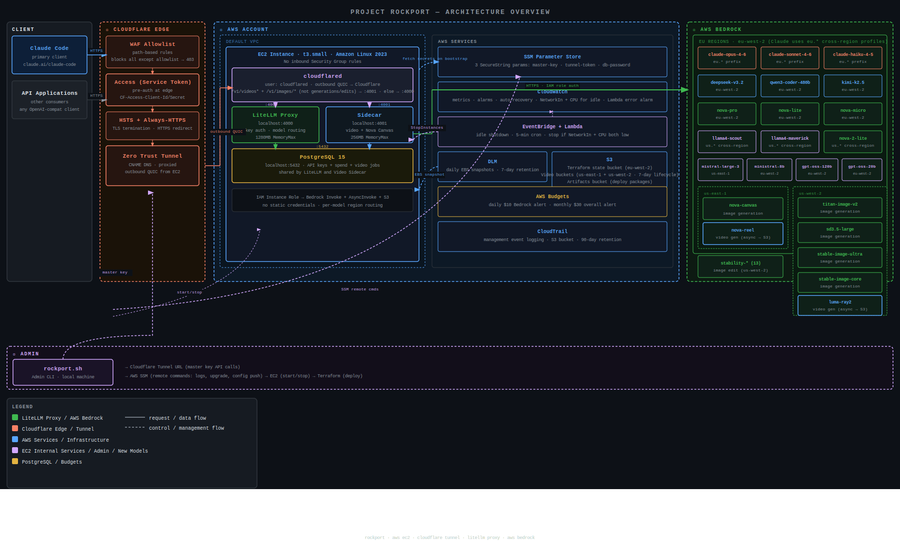
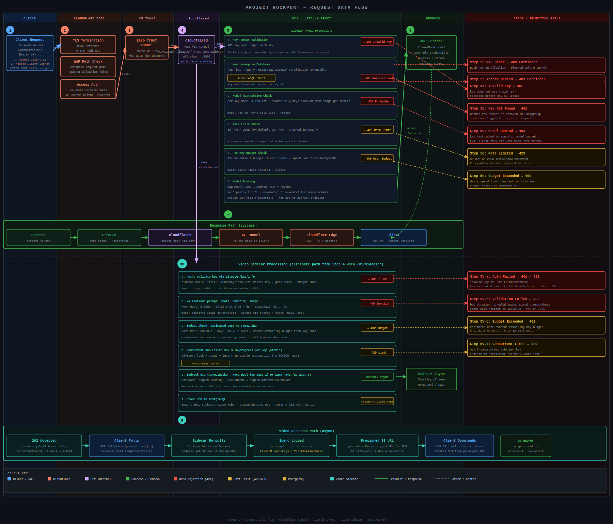

# Rockport

OpenAI-compatible LiteLLM proxy on EC2 that routes any application to Bedrock models — chat, image generation, and video generation — through a single HTTPS endpoint. Built for Claude Code but works with any OpenAI SDK client. Cloudflare Tunnel provides ingress with zero inbound ports; Terraform manages everything.

## Architecture

[](https://raw.githubusercontent.com/matthewdeaves/rockport/main/docs/rockport_architecture_overview.svg)

[](https://raw.githubusercontent.com/matthewdeaves/rockport/main/docs/rockport_request_dataflow.svg)

## What you get

- Claude Code connects via `ANTHROPIC_BASE_URL` to your own proxy
- Anthropic (Opus 4.6, Sonnet 4.6, Haiku 4.5), DeepSeek V3.2, Qwen3 Coder 480B, Kimi K2.5, Nova Pro/Lite/Micro, Nova 2 Lite, Llama 4 Scout/Maverick, Mistral Large 3, Ministral 8B, GPT-OSS 120B/20B on Bedrock
- Image generation via OpenAI-compatible `/v1/images/generations` (Nova Canvas, Titan Image v2, SD3.5 Large, Stable Image Ultra, Stable Image Core)
- Image editing via `/v1/images/edits` — 13 Stability AI operations (structure, sketch, style transfer, upscale, inpaint, erase, search & recolor, and more) via LiteLLM native
- Image services via sidecar: variations, background removal, outpainting (Nova Canvas)
- Video generation via `/v1/videos/generations` (Nova Reel v1.1 + Luma Ray2 — async jobs with presigned S3 URLs)
- Virtual API keys with per-key budgets, rate limits, and model restrictions
- Zero inbound security group rules — all traffic flows through Cloudflare Tunnel
- Daily EBS snapshots with 7-day retention
- Auto-recovery on system failure
- Auto-stop after 30 minutes of inactivity (checks both network and CPU; 10-minute grace period after boot)
- Daily Bedrock budget alerts + monthly overall AWS budget alerts
- `rockport` CLI for key management, logs, deploys, start/stop

## Prerequisites

Before you start, you need:

1. **An AWS account** with an IAM user that has admin access (or root credentials for first-time setup)
2. **A Cloudflare account** with a domain — you'll create an API token and a tunnel
3. **Bedrock model access** — chat models auto-enable on first use. Stability AI image models (SD3.5 Large, Stable Image Ultra, Stable Image Core, and all Stability AI image edit models) and Luma Ray2 require a one-time Marketplace subscription (use them once in the Bedrock playground to activate)

### Cloudflare API token

Create a token at https://dash.cloudflare.com/profile/api-tokens with these permissions:
- **Zone / DNS / Edit**
- **Zone / Zone WAF / Edit**
- **Account / Cloudflare Tunnel / Edit**
- **Account / Zero Trust / Edit** (for Cloudflare Access service token authentication)

You'll also need your Cloudflare **Zone ID** and **Account ID** (found on the domain overview page).

### Bedrock model access

Serverless foundation models auto-enable on first invocation. For Stability AI image models (SD3.5 Large, Stable Image Ultra, Stable Image Core, and all Stability AI image edit models like inpaint, erase, upscale, etc.) and Luma Ray2, open the model in the Bedrock playground once to trigger the Marketplace subscription. Chat models (Claude, Nova, etc.) work immediately.

## Setup

### 1. Install tools

```bash
./scripts/setup.sh
```

This installs AWS CLI v2, Session Manager plugin, Terraform, GitHub CLI, ShellCheck, Trivy, Checkov, and Gitleaks. Or install them manually.

### 2. Configure AWS credentials

You need working AWS credentials before running `init`. How you do this depends on your situation:

**Fresh AWS account (no IAM users yet):**

Use your root account access keys temporarily. Go to AWS Console > IAM > Security credentials > Create access key, then:

```bash
aws configure
# AWS Access Key ID: <root-access-key>
# AWS Secret Access Key: <root-secret-key>
# Default region name: eu-west-2
```

The `init` command will create a dedicated `rockport-deployer` IAM user with scoped permissions and configure a `rockport` AWS CLI profile automatically. After init completes, you can delete the root access keys — all subsequent commands use the `rockport` profile.

**Existing AWS account with an admin IAM user:**

```bash
aws configure
# AWS Access Key ID: <your-admin-key>
# AWS Secret Access Key: <your-admin-secret>
# Default region name: eu-west-2
```

Again, `init` will create the `rockport-deployer` user and `rockport` CLI profile. Your admin user only needs to be used for this one-time setup.

### 3. Initialize

```bash
./scripts/rockport.sh init
```

This is an interactive setup that:
- Prompts for your AWS region, domain, Cloudflare IDs, and budget alert email
- Creates 3 scoped deployer IAM policies (compute, IAM/SSM, monitoring/storage — least-privilege, no wildcards)
- Creates a `rockport-deployer` IAM user with access keys and configures a `rockport` AWS CLI profile
- Generates a master API key and stores it in SSM Parameter Store
- Creates an S3 bucket for Terraform state

After init, all `rockport.sh` commands automatically use the `rockport` AWS CLI profile (deployer credentials). Your admin credentials are only needed for `init` — the deployer has an explicit deny on attaching non-Rockport IAM policies, preventing privilege escalation.

If you already have a `terraform.tfvars` from a previous setup, init will ask whether to keep it and just ensure the IAM policies, master key, and state bucket exist.

### 4. Deploy

```bash
./scripts/rockport.sh deploy
```

Takes ~2 minutes for Terraform, then ~3 minutes for the EC2 instance to bootstrap (installs PostgreSQL, LiteLLM, cloudflared).

### 5. Verify and configure Claude Code

```bash
# Wait for bootstrap (~3 min), then check health:
./scripts/rockport.sh status

# Generate a key and get Claude Code config:
./scripts/rockport.sh setup-claude

# Copy the generated settings file:
cp config/claude-code-settings-<key-name>.json ~/.claude/settings.json
```

Launch Claude Code. Default model routes to Opus 4.6.

## Admin CLI

```bash
./scripts/rockport.sh init                          # Interactive setup
./scripts/rockport.sh deploy                        # Run terraform apply
./scripts/rockport.sh status                        # Health check + model list
./scripts/rockport.sh models                        # List available models
./scripts/rockport.sh key create <name> [--budget N] [--claude-only] # Create API key
./scripts/rockport.sh key list                      # List all keys with spend
./scripts/rockport.sh key info <key>                # Key details + spend
./scripts/rockport.sh key revoke <key>              # Revoke a key
./scripts/rockport.sh spend                         # Combined infra + model usage summary
./scripts/rockport.sh spend keys                    # Spend breakdown by key
./scripts/rockport.sh spend models                  # Spend breakdown by model
./scripts/rockport.sh spend daily [N]               # Daily spend for last N days (default 30)
./scripts/rockport.sh spend today                   # Today's spend by key and model
./scripts/rockport.sh spend infra [N]               # AWS infrastructure costs for last N months (default 3)
./scripts/rockport.sh monitor                       # Key status + recent requests
./scripts/rockport.sh monitor --live                # Live dashboard (auto-refresh)
./scripts/rockport.sh config push                   # Push config to instance + restart
./scripts/rockport.sh logs                          # Stream LiteLLM logs
./scripts/rockport.sh upgrade                       # Restart LiteLLM + video sidecar
./scripts/rockport.sh start                         # Start a stopped instance
./scripts/rockport.sh stop                          # Stop the instance
./scripts/rockport.sh setup-claude                  # Create Anthropic-only key + Claude Code config
./scripts/rockport.sh destroy                       # Tear down everything
```

## Idle auto-stop

The instance automatically stops after 30 minutes of inactivity to save costs. The idle check considers both network traffic (NetworkIn < 500,000 bytes) and CPU utilisation (< 10%) — a high-CPU workload with low network traffic won't be stopped. A CloudWatch alarm fires if the idle-stop Lambda itself fails consecutively. When you need it again:

```bash
./scripts/rockport.sh start
```

The `start` command waits for the health endpoint to respond, so you know when it's ready. Services auto-start on boot — LiteLLM and the Cloudflare Tunnel reconnect within ~60 seconds.

To disable auto-stop, add to `terraform.tfvars`:

```hcl
enable_idle_shutdown = false
```

## Configuration

All settings are in `terraform/terraform.tfvars`. These variables have defaults and can be overridden:

| Variable | Default | Description |
|----------|---------|-------------|
| `region` | `eu-west-2` | AWS region |
| `tunnel_subdomain` | `llm` | Subdomain for the Cloudflare Tunnel |
| `instance_type` | `t3.small` | EC2 instance type |
| `litellm_version` | `1.82.3` | LiteLLM version to install |
| `cloudflared_version` | `2026.3.0` | Cloudflared version (pinned for stability) |
| `cloudflared_sha256` | *(matches version)* | SHA256 of cloudflared binary — must update when changing version |
| `bedrock_daily_budget` | `10` | Daily Bedrock spend alert threshold (USD) |
| `monthly_budget` | `30` | Monthly overall AWS budget alert threshold (USD) |
| `enable_idle_shutdown` | `true` | Auto-stop instance after inactivity |
| `idle_timeout_minutes` | `30` | Minutes of inactivity before auto-stop |
| `idle_threshold_bytes` | `500000` | Network bytes below which instance is considered idle |
| `video_max_concurrent_jobs` | `3` | Maximum concurrent video generation jobs per API key |
| `enable_guardrails` | `false` | Enable optional Bedrock Guardrails (content filtering, PII masking) |

Model configuration is in `config/litellm-config.yaml`. After editing, push changes to the running instance:

```bash
./scripts/rockport.sh config push
```

Budget and rate limit defaults are also in `litellm-config.yaml`:
- Global budget: `$10/day`
- Per-key default budget: `$5/day`
- Rate limits: `60 RPM`, `200K TPM` per key

### Image generation

Image generation uses the OpenAI-compatible `/v1/images/generations` endpoint. Pass dimensions via the `size` parameter (e.g. `"1024x768"`).

| Model | Dimensions | Constraint | Default |
|-------|-----------|------------|---------|
| Nova Canvas | 320–4096 per side | Must be divisible by 16 | 1024x1024 |
| Titan Image v2 | Preset sizes | 256, 512, 768, 1024, 1152, 1408 combinations | 512x512 |
| SD3.5 Large | Fixed 1024x1024 | `size` parameter ignored, returns JPEG not PNG | 1024x1024 |
| Stable Image Ultra | Aspect ratio based | High quality, supports image-to-image, JPEG/PNG only | 1:1 |
| Stable Image Core | Aspect ratio based | Text-to-image only, cheap drafts, JPEG/PNG only | 1:1 |

Nova Canvas also supports 8 built-in style presets via the `textToImageParams.style` field: `3D_ANIMATED_FAMILY_FILM`, `DESIGN_SKETCH`, `FLAT_VECTOR_ILLUSTRATION`, `GRAPHIC_NOVEL_ILLUSTRATION`, `MAXIMALISM`, `MIDCENTURY_RETRO`, `PHOTOREALISM`, `SOFT_DIGITAL_PAINTING`.

```bash
curl -X POST https://<your-domain>/v1/images/generations \
  -H "Authorization: Bearer $KEY" \
  -H "Content-Type: application/json" \
  -d '{"model":"nova-canvas","prompt":"a mountain landscape","size":"1024x768","n":1}'
```

Response contains `data[0].b64_json` with the base64-encoded PNG. Keys created with `--claude-only` cannot access image models.

#### Image-to-image (conditioned generation)

Pass a source image to modify it with a text prompt. Use the same `/v1/images/generations` endpoint with model-specific parameters:

**Nova Canvas** — pass `conditionImage` (base64) in `textToImageParams`:

```bash
curl -X POST https://<your-domain>/v1/images/generations \
  -H "Authorization: Bearer $KEY" \
  -H "Content-Type: application/json" \
  -d '{
    "model": "nova-canvas",
    "prompt": "transform into a watercolor painting",
    "size": "512x512",
    "n": 1,
    "textToImageParams": {"conditionImage": "<base64-encoded-image>"}
  }'
```

Source images must be base64-encoded PNG or JPEG. Nova Canvas requires minimum 320px per side. SD3.5 Large also supports `mode: "image-to-image"` with an `image` and `strength` parameter, but always outputs 1024x1024 JPEG — Nova Canvas is recommended for image-to-image.

**Note:** For Nova Canvas and Titan, use `/v1/images/generations` with `conditionImage` for image-to-image. `/v1/images/edits` is the Stability AI image edit endpoint (see below).

#### Stability AI image editing (via LiteLLM)

All 13 Stability AI image edit operations use LiteLLM's native `/v1/images/edits` endpoint with `multipart/form-data`. Specify the operation via the `model` field. Keys created with `--claude-only` cannot access these models. All require a one-time Marketplace subscription.

| Model | Description | Cost |
|-------|-------------|------|
| `stability-structure` | Structure-guided generation (maintain composition) | $0.04 |
| `stability-sketch` | Sketch-to-image generation | $0.04 |
| `stability-style-transfer` | Transfer style between images | $0.06 |
| `stability-remove-background` | Remove background | $0.04 |
| `stability-search-replace` | Find and replace objects in an image | $0.04 |
| `stability-upscale` | Conservative upscale (max 1MP input) | $0.06 |
| `stability-style-guide` | Style-guided generation with reference image | $0.04 |
| `stability-inpaint` | Mask regions and replace with prompt-guided content | $0.04 |
| `stability-erase` | Mask regions and remove objects (no prompt needed) | $0.04 |
| `stability-creative-upscale` | Prompt-guided upscale to 4K (max 1MP input) | $0.06 |
| `stability-fast-upscale` | Deterministic 4x upscale (32–1536px, no prompt) | $0.04 |
| `stability-search-recolor` | Find objects by description and change their colour | $0.04 |
| `stability-outpaint` | Extend image directionally (left/right/up/down) | $0.04 |

```bash
curl -X POST https://<your-domain>/v1/images/edits \
  -H "Authorization: Bearer $KEY" \
  -F "model=stability-remove-background" \
  -F "image=@photo.png"
```

Response contains `data[0].b64_json` with the base64-encoded image. LiteLLM handles auth, budget enforcement, and spend tracking natively.

#### Nova Canvas sidecar endpoints

Advanced Nova Canvas operations run on the sidecar (port 4001) and are routed via `/v1/images/*` (except `/v1/images/generations` and `/v1/images/edits` which go to LiteLLM). Keys created with `--claude-only` cannot access these endpoints.

| Endpoint | Description |
|----------|-------------|
| `POST /v1/images/variations` | Generate variations of input images with a text prompt |
| `POST /v1/images/background-removal` | Remove the background from an image |
| `POST /v1/images/outpaint` | Extend an image beyond its borders using a mask |

These endpoints authenticate via LiteLLM, enforce per-key budgets, and log spend to the unified tracking tables.

### Video generation

Video generation uses a sidecar service on port 4001 that supports multiple Bedrock video models. Bedrock's async invoke API (`StartAsyncInvoke` / `GetAsyncInvoke` with S3 output) isn't supported by LiteLLM ([tracking discussion](https://github.com/BerriAI/litellm/discussions/9320)) — the sidecar handles this and can be decommissioned if LiteLLM adds Bedrock async invoke support. The workflow is asynchronous — submit a job, then poll for completion. Specify the model via the `model` field (defaults to `nova-reel`).

**Single-shot mode** — one prompt, variable duration:

```bash
# Submit a video generation job
curl -X POST https://<your-domain>/v1/videos/generations \
  -H "Authorization: Bearer $KEY" \
  -H "Content-Type: application/json" \
  -d '{
    "prompt": "a drone flyover of a coastal cliff at sunset",
    "duration": 12,
    "seed": 42
  }'
```

Duration must be a multiple of 6, from 6 to 120 seconds. `seed` is optional (for reproducibility). You can also pass an optional reference image as a PNG or JPEG data URI in the `image` field (auto-resized to 1280x720 if needed — see resize modes below).

The POST returns `202 Accepted` with a job ID:

```json
{"id": "job_abc123", "status": "in_progress", "mode": "single_shot", "duration": 12, "estimated_cost": 0.96, "created_at": "..."}
```

Poll for completion:

```bash
curl https://<your-domain>/v1/videos/generations/job_abc123 \
  -H "Authorization: Bearer $KEY"
```

A completed job returns a presigned S3 URL (expires after 1 hour):

```json
{"id": "job_abc123", "status": "completed", "mode": "single_shot", "duration": 12, "cost": 0.96, "url": "https://...s3.amazonaws.com/...", "url_expires_at": "..."}
```

**Multi-shot mode** — 2 to 20 per-shot prompts, 6 seconds each:

```bash
curl -X POST https://<your-domain>/v1/videos/generations \
  -H "Authorization: Bearer $KEY" \
  -H "Content-Type: application/json" \
  -d '{
    "shots": [
      {"prompt": "a rocket on the launchpad, pre-dawn light"},
      {"prompt": "the rocket lifts off with a plume of smoke"},
      {"prompt": "aerial view of the rocket climbing through clouds"}
    ]
  }'
```

Each shot is 6 seconds. Shots can optionally include a per-shot `image` field (1280x720 data URI).

**Automated multi-shot mode** — single prompt, model determines shot breakdown:

```bash
curl -X POST https://<your-domain>/v1/videos/generations \
  -H "Authorization: Bearer $KEY" \
  -H "Content-Type: application/json" \
  -d '{
    "mode": "multi-shot-automated",
    "prompt": "A detailed story of a rocket launching from a coastal pad at sunrise, climbing through clouds, and reaching orbit with Earth visible below",
    "duration": 24
  }'
```

Duration must be 12–120 seconds (multiples of 6). Prompt can be up to 4000 characters. Nova Reel only.

**Luma Ray2** — shorter clips with flexible aspect ratios and resolutions:

```bash
curl -X POST https://<your-domain>/v1/videos/generations \
  -H "Authorization: Bearer $KEY" \
  -H "Content-Type: application/json" \
  -d '{
    "model": "luma-ray2",
    "prompt": "a tiger walking through snow",
    "duration": 5,
    "aspect_ratio": "16:9",
    "resolution": "720p",
    "loop": true
  }'
```

Ray2 supports 7 aspect ratios (16:9, 9:16, 1:1, 4:3, 3:4, 21:9, 9:21), two resolutions (540p, 720p), and optional start/end frame images via `image` and `end_image` fields. Requires a one-time Marketplace subscription (same as SD3.5 Large).

| Detail | Nova Reel | Luma Ray2 |
|--------|-----------|-----------|
| Cost | $0.08/second | $0.75/s (540p), $1.50/s (720p) |
| Resolution | 1280x720 fixed | 540p or 720p, 7 aspect ratios |
| Duration | 6–120s (multiples of 6) | 5s or 9s |
| Multi-shot (manual) | 2–20 shots, 6s each | Not supported |
| Multi-shot (automated) | Single prompt, 12–120s, model picks shots | Not supported |
| Image-to-video | Start frame (auto-resized to 1280x720, 6s only) | Start + optional end frame (512–4096px) |
| Loop | No | Yes |
| Seed | Yes | No |
| Concurrent jobs per key | 3 (configurable via `VIDEO_MAX_CONCURRENT_JOBS`) | Same |
| Output storage | S3 bucket with 7-day lifecycle | Same |
| Presigned URL expiry | 1 hour | Same |

## CI/CD

Two GitHub Actions workflows run on push to `main`:

**Validate** (`validate.yml`) — runs on pushes and PRs to `main` (paths: `terraform/`, `config/`, `scripts/`, `sidecar/`, `tests/`, CI config):
- `terraform fmt -check` and `terraform validate`
- ShellCheck on all shell scripts
- Gitleaks secrets scan
- Trivy IaC security scan
- Checkov policy-as-code scan

**Deploy** (`deploy.yml`) — runs on push to `main` (paths: `terraform/`, `config/`, `scripts/`, `sidecar/`, `tests/`):
- `terraform plan` on PRs (saves plan as artifact)
- Plans and applies on merge to `main`
- Smoke tests after deploy

CI uses GitHub OIDC for AWS authentication. Set `AWS_ROLE_ARN` in GitHub repository secrets to an IAM role with OIDC trust policy. Also set `CLOUDFLARE_ZONE_ID`, `CLOUDFLARE_ACCOUNT_ID`, and `CLOUDFLARE_API_TOKEN` as secrets.

## Security design

Rockport is designed so that the proxy has no direct internet exposure. Every layer adds defense in depth:

**Network isolation** — The EC2 instance has zero inbound security group rules. No SSH, no HTTP, nothing. All traffic reaches LiteLLM exclusively through Cloudflare Tunnel, which maintains an outbound-only connection to Cloudflare's edge.

**Localhost-only binding** — LiteLLM listens on `127.0.0.1:4000`, not `0.0.0.0`. Even if the security group were misconfigured, the service would not accept external connections directly.

**Admin UI disabled** — The LiteLLM admin dashboard is disabled via `disable_admin_ui: true` and Swagger/ReDoc docs are disabled via `NO_DOCS=True` / `NO_REDOC=True` environment variables. A Cloudflare WAF allowlist (`terraform/waf.tf`) blocks all paths except those needed by Claude Code, image generation, image editing, image services, and the admin CLI — only `/v1/chat/completions`, `/v1/models`, `/v1/messages`, `/v1/images/generations`, `/v1/images/*`, `/v1/videos/*`, `/key/*`, `/health` (exact match), `/spend/*`, and a handful of other operational paths are reachable. Everything else (admin UI, OpenAPI schema, routes list, SSO, SCIM, debug endpoints, etc.) returns 403 at the Cloudflare edge.

**Key separation** — The master key (stored in SSM Parameter Store) is only used by the admin CLI. Users get virtual keys with per-key daily budgets and rate limits. Keys created with `--claude-only` (or via `setup-claude`) are restricted to Anthropic models only. Keys without this flag get access to all models including image generation. Virtual keys can only call model endpoints — they cannot create other keys, view spend, or manage the proxy.

**Secrets handling** — All secrets are auto-generated — no manual credential creation beyond the Cloudflare API token. The master key is generated during `init`, the Cloudflare Access service token and tunnel token are created by `terraform apply`, the database password is generated during EC2 bootstrap, and the deployer IAM access keys are created during `init`. All are stored as SSM SecureString parameters (encrypted at rest with AWS KMS) or as Terraform-managed resources. The database password never appears in logs. Environment files are written with `umask 077` to prevent brief permission windows.

**Systemd hardening** — All services (LiteLLM, cloudflared, video sidecar) run as dedicated non-root users with `NoNewPrivileges=yes`, `ProtectSystem=strict`, `ProtectHome=yes`, `PrivateTmp=yes`, `SystemCallFilter=@system-service`, `PrivateDevices=yes`, `RestrictNamespaces=yes`, `CapabilityBoundingSet=` (all capabilities dropped), `ProtectControlGroups=yes`, `RestrictSUIDSGID=yes`, and memory limits. The `litellm` user's home directory is `/var/lib/litellm` (not `/home/litellm`) so prisma cache is accessible under `ProtectHome=yes`.

**IMDSv2 enforced** — The instance metadata service requires session tokens (hop limit 1), preventing SSRF-based credential theft.

**Transport security** — HSTS (6 months max-age) and "Always Use HTTPS" are enabled in Cloudflare, enforcing HTTPS-only access. HTTP requests are redirected with 301.

**Least-privilege IAM** — The deployer IAM policies (`terraform/deployer-policies/`) scope EC2 and SSM mutating actions to resources tagged `Project=rockport`. Read-only Describe actions use `Resource: *` as required by AWS. An explicit Deny statement prevents the deployer from attaching any AWS-managed policy (e.g. `AdministratorAccess`) to rockport roles — only rockport-prefixed custom policies are allowed, blocking privilege escalation via the CI/CD pipeline. The instance role is limited to Bedrock invoke and SSM parameter access.

**CI security scanning** — Every push runs Trivy (IaC misconfiguration) and Checkov (policy-as-code) against the Terraform. Skipped checks are documented with justifications in `.checkov.yaml`.

**Cloudflare Access pre-authentication** — A Cloudflare Access application (`terraform/access.tf`) requires a service token for all requests. Clients must send `CF-Access-Client-Id` and `CF-Access-Client-Secret` headers or Cloudflare returns 403 before traffic reaches the tunnel. This adds a second credential layer beyond API keys — even if an API key leaks, requests are blocked without the service token. Token values are sensitive Terraform outputs. To rotate: create a new service token, update all clients, then remove the old one.

**Database authentication** — PostgreSQL uses SCRAM-SHA-256 for all client authentication (not md5). Connections are localhost-only with no TLS (traffic never leaves the kernel's loopback interface).

### What's exposed

All requests require both a valid Cloudflare Access service token and a valid LiteLLM API key. A Cloudflare WAF allowlist further restricts traffic to only the paths Claude Code and the admin CLI need. All other paths (admin UI, API docs, debug endpoints, SCIM, SSO, etc.) are blocked with 403 at the edge. The remaining attack surface is:

- Brute-force key guessing (mitigated by key length — master key is `sk-` + 48 hex characters; virtual keys use LiteLLM's default token format)
- Cloudflare-level DDoS (mitigated by Cloudflare's built-in protection)
- Service token compromise (mitigated by token rotation via Terraform)

## Smoke tests

```bash
# With CF Access headers (required when Cloudflare Access is enabled)
./tests/smoke-test.sh https://<your-domain> <cf-client-id> <cf-client-secret>

# Or via environment variables
export CF_ACCESS_CLIENT_ID=<cf-client-id>
export CF_ACCESS_CLIENT_SECRET=<cf-client-secret>
./tests/smoke-test.sh https://<your-domain>
```

The smoke test creates and cleans up its own temporary API key via the admin CLI. It costs ~$0.05 per run (one chat + one image generation call).

## Teardown

```bash
./scripts/rockport.sh destroy
```

This removes all AWS resources, Cloudflare Tunnel + DNS record, and SSM parameters (master key, database password).
